# Eva Onboarding Concierge - Architecture Documentation

## Overview

Eva is a sophisticated AI-powered onboarding concierge built with Google's Agent Development Kit (ADK). It provides a seamless, "white-glove" onboarding experience for new employees through a hierarchical multi-agent architecture that coordinates specialized sub-agents to handle everything from identity creation and IT provisioning to secure access requests and HR questions.

## Architecture Diagram

```mermaid
graph TB
    %% User Interface
    User[👤 User/HR Admin] --> Eva[🤖 Eva Orchestrator Agent<br/>Root Agent]
    
    %% Eva's Direct Tools
    Eva --> EvaTools[📋 Eva Tools<br/>• start_onboarding_session<br/>• get_onboarding_status<br/>• update_checklist_item<br/>• generate_onboarding_summary<br/>• list_active_onboarding_sessions]
    
    %% Sub-Agents Level 1
    Eva --> IDMaster[🆔 ID Master Agent]
    Eva --> DeviceDepot[💻 Device Depot Agent]
    Eva --> AccessWorkflow[🔐 Access Workflow Orchestrator]
    Eva --> HRHelper[📚 HR Helper Agent]
    Eva --> MeetingMaven[📅 Meeting Maven Agent]
    
    %% ID Master Tools
    IDMaster --> IDTools[🔧 ID Master Tools<br/>• create_ad_account<br/>• setup_email_account<br/>• generate_credentials<br/>• assign_security_groups<br/>• verify_account_creation]
    
    %% Device Depot Tools
    DeviceDepot --> DeviceTools[🔧 Device Depot Tools<br/>• request_equipment<br/>• check_ticket_status<br/>• get_available_equipment<br/>• create_deployment_schedule<br/>• track_deployment<br/>• generate_equipment_report]
    
    %% Access Workflow Orchestrator (Sub-orchestrator)
    AccessWorkflow --> ServiceNow[🎫 ServiceNow Agent]
    AccessWorkflow --> ADAgent[🏢 Active Directory Agent]
    
    %% ServiceNow Agent Tools
    ServiceNow --> ServiceNowTools[🔧 ServiceNow Tools<br/>• create_service_request<br/>• get_approval_status<br/>• close_work_order<br/>• list_pending_requests]
    
    %% AD Agent Tools
    ADAgent --> ADTools[🔧 AD Agent Tools<br/>• add_user_to_ad_group<br/>• verify_ad_group_membership<br/>• remove_user_from_ad_group<br/>• list_ad_groups]
    
    %% HR Helper (Multi-agent system)
    HRHelper --> TimeOffAgent[📅 Time Off Policy Agent]
    HRHelper --> PerformanceAgent[📊 Performance Policy Agent]
    HRHelper --> HRTools[🔧 HR Helper Tools<br/>• get_general_hr_info<br/>• list_hr_resources<br/>• get_hr_contacts]
    
    %% Time Off Agent Tools
    TimeOffAgent --> TimeOffTools[🔧 Time Off Tools<br/>• search_timeoff_policy]
    
    %% Performance Agent Tools
    PerformanceAgent --> PerformanceTools[🔧 Performance Tools<br/>• search_performance_policy]
    
    %% Meeting Maven Tools
    MeetingMaven --> MeetingTools[🔧 Meeting Maven Tools<br/>• check_availability<br/>• find_meeting_slots<br/>• schedule_meeting<br/>• get_meeting_details<br/>• cancel_meeting<br/>• list_upcoming_meetings]
    
    %% External Systems (Simulated)
    IDTools -.-> MSActiveDirectory[Microsoft Active Directory]
    DeviceTools -.-> ServiceNowSys[ServiceNow System]
    ServiceNowTools -.-> ServiceNowSys
    ADTools -.-> MSActiveDirectory
    TimeOffTools -.-> PolicyPDFs[📄 Policy PDF Documents]
    PerformanceTools -.-> PolicyPDFs
    MeetingTools -.-> GoogleCalendar[Google Calendar]
    
    %% Data Sources
    PolicyPDFs --> TimeOffPDF[timeoff-policy.pdf]
    PolicyPDFs --> PerformancePDF[performance-policy.pdf]
    
    %% Styling
    classDef rootAgent fill:#e1f5fe,stroke:#01579b,stroke-width:3px
    classDef subAgent fill:#f3e5f5,stroke:#4a148c,stroke-width:2px
    classDef subSubAgent fill:#fff3e0,stroke:#e65100,stroke-width:2px
    classDef tools fill:#e8f5e8,stroke:#2e7d32,stroke-width:1px
    classDef external fill:#ffebee,stroke:#c62828,stroke-width:1px,stroke-dasharray: 5 5
    classDef data fill:#f1f8e9,stroke:#33691e,stroke-width:1px
    
    class Eva rootAgent
    class IDMaster,DeviceDepot,AccessWorkflow,HRHelper,MeetingMaven subAgent
    class ServiceNow,ADAgent,TimeOffAgent,PerformanceAgent subSubAgent
    class EvaTools,IDTools,DeviceTools,ServiceNowTools,ADTools,HRTools,TimeOffTools,PerformanceTools,MeetingTools tools
    class MSActiveDirectory,ServiceNowSys,GoogleCalendar external
    class PolicyPDFs,TimeOffPDF,PerformancePDF data
```

## Agent Hierarchy and Responsibilities

### 🤖 Eva Orchestrator Agent (Root Agent)
**Role**: Primary conversational AI and "General Manager"
**Model**: `gemini-2.0-flash-exp` (Root Agent Model)
**Responsibilities**:
- Manages end-to-end user experience
- Coordinates all specialist sub-agents
- Maintains onboarding session state
- Provides comprehensive onboarding workflow orchestration

**Tools**:
- `start_onboarding_session()` - Initiates comprehensive onboarding for new employees
- `get_onboarding_status()` - Retrieves current onboarding progress and status
- `update_checklist_item()` - Updates specific checklist categories and progress
- `generate_onboarding_summary()` - Creates detailed onboarding reports
- `list_active_onboarding_sessions()` - Lists all active onboarding sessions

**Sub-Agents**: ID Master, Device Depot, Access Workflow Orchestrator, HR Helper, Meeting Maven

---

### 🆔 ID Master Agent
**Role**: Digital identity creation and management specialist
**Model**: `gemini-2.5-flash-preview-05-20` (Sub-Agent Model)
**Responsibilities**:
- Creates and manages core digital identity
- Sets up Active Directory accounts
- Configures email accounts and credentials
- Assigns appropriate security groups

**Tools**:
- `create_ad_account()` - Creates new Active Directory user accounts
- `setup_email_account()` - Configures email accounts and mailboxes
- `generate_credentials()` - Generates secure login credentials
- `assign_security_groups()` - Assigns users to appropriate security groups
- `verify_account_creation()` - Verifies successful account setup

**External Systems**: Microsoft Active Directory

---

### 💻 Device Depot Agent
**Role**: IT equipment provisioning and deployment specialist
**Model**: `gemini-2.5-flash-preview-05-20` (Sub-Agent Model)
**Responsibilities**:
- Manages IT equipment requests and approvals
- Handles equipment deployment scheduling
- Tracks equipment delivery and setup
- Generates equipment reports and analytics

**Tools**:
- `request_equipment()` - Creates equipment requests with approval workflows
- `check_ticket_status()` - Monitors equipment request status
- `get_available_equipment()` - Lists available equipment inventory
- `create_deployment_schedule()` - Schedules equipment delivery and setup
- `track_deployment()` - Tracks deployment progress and status
- `generate_equipment_report()` - Creates equipment usage and cost reports

**External Systems**: ServiceNow (for ticket management)

---

### 🔐 Access Workflow Orchestrator (Sub-Orchestrator)
**Role**: Secure access management coordinator
**Model**: `gemini-2.5-flash-preview-05-20` (Sub-Agent Model)
**Responsibilities**:
- Manages secure, multi-step access granting processes
- Coordinates between ServiceNow and Active Directory
- Handles approval workflows for sensitive group access
- Maintains audit trails for access operations

**Sub-Agents**:

#### 🎫 ServiceNow Agent
**Role**: Service request and work order management
**Tools**:
- `create_service_request()` - Creates service requests for AD group access
- `get_approval_status()` - Checks approval status and creates work orders
- `close_work_order()` - Closes work orders after completion
- `list_pending_requests()` - Lists pending access requests

#### 🏢 Active Directory Agent
**Role**: AD group membership management
**Tools**:
- `add_user_to_ad_group()` - Adds users to AD groups based on work orders
- `verify_ad_group_membership()` - Verifies group memberships
- `remove_user_from_ad_group()` - Removes users from groups with audit trail
- `list_ad_groups()` - Lists available AD groups with metadata

**External Systems**: ServiceNow, Microsoft Active Directory

---

### 📚 HR Helper Agent (Multi-Agent System)
**Role**: HR information and policy specialist coordinator
**Model**: `gemini-2.5-flash-preview-05-20` (Sub-Agent Model)
**Responsibilities**:
- Routes HR questions to appropriate specialists
- Provides general HR information
- Manages access to policy documents
- Handles HR contact information

**Tools**:
- `get_general_hr_info()` - Retrieves general HR information from handbook
- `list_hr_resources()` - Lists available HR resources and topics
- `get_hr_contacts()` - Provides HR contact information

**Sub-Agents**:

#### 📅 Time Off Policy Agent
**Role**: Time off and vacation policy specialist
**Tools**:
- `search_timeoff_policy()` - Searches time off policy documents

#### 📊 Performance Policy Agent
**Role**: Performance management policy specialist
**Tools**:
- `search_performance_policy()` - Searches performance policy documents

**Data Sources**: 
- `timeoff-policy.pdf` - Company time off policies
- `performance-policy.pdf` - Performance management policies

---

### 📅 Meeting Maven Agent
**Role**: Meeting scheduling and calendar coordination specialist
**Model**: `gemini-2.5-flash-preview-05-20` (Sub-Agent Model)
**Responsibilities**:
- Checks calendar availability for multiple attendees
- Finds optimal meeting times
- Schedules meetings and sends invitations
- Manages meeting lifecycle (creation, updates, cancellation)

**Tools**:
- `check_availability()` - Checks availability for multiple attendees
- `find_meeting_slots()` - Finds available meeting slots
- `schedule_meeting()` - Schedules meetings and sends invitations
- `get_meeting_details()` - Retrieves meeting information
- `cancel_meeting()` - Cancels scheduled meetings
- `list_upcoming_meetings()` - Lists upcoming meetings for attendees

**External Systems**: Google Calendar

---

## Configuration Management

### Centralized Configuration System
The system uses a centralized configuration approach through the `EvaConfig` class:

**Configuration Categories**:
- **Google Cloud Configuration**: Project ID, location, storage settings
- **Agent Model Configuration**: Different models for root vs sub-agents
- **Enterprise System Integration**: Active Directory, ServiceNow, Google Workspace
- **Security Configuration**: Password policies, access controls, audit logging
- **Notification Configuration**: Email, Slack, Teams integration
- **Feature Flags**: Dynamic feature enable/disable
- **Development Settings**: Debug modes, logging levels

**Key Configuration Parameters**:
- `ROOT_AGENT_MODEL`: Model for Eva Orchestrator (gemini-2.0-flash-exp)
- `SUB_AGENT_MODEL`: Model for all sub-agents (gemini-2.5-flash-preview-05-20)
- `PROJECT_ID`: Google Cloud project identifier
- `LOCATION`: Google Cloud region (us-central1)

---

## Data Flow and Workflow

### Typical Onboarding Workflow

1. **Initiation**: HR Admin starts onboarding session through Eva
2. **Identity Management**: Eva delegates to ID Master for account creation
3. **Equipment Provisioning**: Eva coordinates with Device Depot for hardware requests
4. **Access Management**: Eva works with Access Workflow Orchestrator for group permissions
5. **HR Orientation**: Eva leverages HR Helper for policy information and guidance
6. **Meeting Coordination**: Eva uses Meeting Maven to schedule orientation meetings
7. **Progress Tracking**: Eva maintains overall progress and provides status updates
8. **Completion**: Eva generates comprehensive onboarding summary

### Agent Communication Patterns

- **Hierarchical Delegation**: Eva delegates tasks to appropriate specialist agents
- **Sub-Orchestration**: Access Workflow Orchestrator manages its own sub-agents
- **Specialist Routing**: HR Helper routes questions to policy-specific agents
- **Status Aggregation**: Eva collects and synthesizes responses from all sub-agents
- **Error Handling**: Each agent provides detailed error information and fallback options

---

## External System Integration

### Simulated Enterprise Systems
The system simulates integration with common enterprise systems:

- **Microsoft Active Directory**: User account and group management
- **ServiceNow**: IT service management and ticketing
- **Google Calendar**: Meeting scheduling and availability
- **HR Document Repository**: Policy documents and employee handbook
- **Equipment Management System**: IT asset tracking and deployment

### Security and Compliance Features
- **Approval Workflows**: Multi-level approval for equipment and access requests
- **Audit Trails**: Comprehensive logging of all operations
- **Access Reviews**: Scheduled reviews of granted permissions
- **Policy Enforcement**: Automated policy compliance checking
- **Secure Credential Management**: Safe handling of authentication credentials

---

## Deployment and Scalability

### ADK CLI Compatibility
- **Entry Point**: `eva_orchestrator_agent.py` for ADK CLI
- **Main Agent**: `agent.py` for direct imports
- **Session Management**: In-memory session service for development
- **Runner Configuration**: Optimized for both local and cloud deployment

### Scalability Features
- **Modular Architecture**: Easy to add new specialist agents
- **Configurable Models**: Different models for different agent types
- **Environment-Specific Configuration**: Development, staging, production configs
- **Cloud-Native Design**: Ready for Google Cloud deployment

---

## Key Benefits

1. **Comprehensive Coverage**: Handles all aspects of employee onboarding
2. **Intelligent Routing**: Automatically directs requests to appropriate specialists
3. **Scalable Architecture**: Easy to extend with new agents and capabilities
4. **Enterprise Integration**: Simulates real-world enterprise system interactions
5. **Audit and Compliance**: Built-in tracking and reporting capabilities
6. **User-Friendly**: Single conversational interface for complex workflows
7. **Configurable**: Centralized configuration management for all environments

---

## Technical Stack

- **Framework**: Google Agent Development Kit (ADK)
- **Language**: Python 3.12+
- **AI Models**: Gemini 2.0 Flash (root), Gemini 2.5 Flash (sub-agents)
- **Session Management**: In-memory session service
- **Configuration**: Environment-based configuration system
- **Documentation**: PDF processing with pdfplumber
- **Testing**: Comprehensive test suites for all agents

This architecture demonstrates a sophisticated multi-agent system that can handle complex, real-world onboarding scenarios while maintaining clear separation of concerns and providing excellent user experience through intelligent orchestration.
