# Eva Onboarding Concierge - Architecture Diagrams

This document contains the visual architecture diagrams for the Eva Onboarding Concierge system. These diagrams can be rendered using Mermaid or other diagram tools.

## 🏗️ **System Architecture Overview**

## 🔄 **Agent Interaction Flow**

```mermaid
sequenceDiagram
    participant User as 👤 HR Manager
    participant Web as 🌐 Web Interface
    participant Eva as 🤖 Eva Orchestrator
    participant IDM as 🆔 ID Master
    participant DD as 💻 Device Depot
    participant AWO as 🔐 Access Workflow
    participant MM as 📅 Meeting Maven
    participant HR as 📋 HR Helper
    participant AD as 🏢 Active Directory
    participant SN as 🎫 ServiceNow
    participant GC as 📅 Google Calendar
    
    User->>Web: "Onboard Alex Johnson as Software Developer"
    Web->>Eva: Process onboarding request
    
    Note over Eva: Analyze request and create workflow plan
    
    Eva->>IDM: Create digital identity for Alex
    IDM->>AD: Create user account
    AD-->>IDM: Account created: alex.johnson@company.com
    IDM-->>Eva: ✅ Identity created
    
    Eva->>DD: Request developer equipment
    DD->>SN: Create equipment ticket
    SN-->>DD: Ticket EQ-2025-001 created
    DD-->>Eva: ✅ Equipment ordered ($3,098)
    
    Eva->>AWO: Request developer access groups
    AWO->>SN: Create access request workflow
    SN-->>AWO: Workflow initiated (pending approval)
    AWO-->>Eva: ✅ Access workflow started
    
    Eva->>MM: Schedule onboarding meetings
    MM->>GC: Check availability and create meetings
    GC-->>MM: Meetings scheduled
    MM-->>Eva: ✅ Meetings scheduled
    
    Eva->>HR: Prepare onboarding documentation
    HR-->>Eva: ✅ Documentation ready
    
    Eva->>Web: Onboarding workflow complete
    Web->>User: 🎉 Alex's onboarding initiated successfully!
    
    Note over User,GC: Complete onboarding process coordinated across all systems
```

## 🏢 **Enterprise Integration Architecture**

```mermaid
graph LR
    subgraph "Eva Agent System"
        EVA[🤖 Eva Orchestrator]
        AGENTS[👥 Specialist Agents]
    end
    
    subgraph "Microsoft Ecosystem"
        AD[🏢 Active Directory<br/>User Management]
        EX[📧 Exchange Online<br/>Email Services]
        SP[📁 SharePoint<br/>Document Management]
        TEAMS[💬 Microsoft Teams<br/>Collaboration]
    end
    
    subgraph "ServiceNow Platform"
        ITSM[🎫 IT Service Management<br/>Ticket System]
        HRSD[👥 HR Service Delivery<br/>Employee Services]
        SEC[🔒 Security Operations<br/>Access Management]
        FLOW[🔄 Workflow Engine<br/>Approval Processes]
    end
    
    subgraph "Google Workspace"
        GMAIL[📧 Gmail<br/>Email Services]
        GCAL[📅 Google Calendar<br/>Scheduling]
        GDRIVE[📁 Google Drive<br/>File Storage]
        MEET[🎥 Google Meet<br/>Video Conferencing]
    end
    
    subgraph "HR Systems"
        HRIS[👥 HRIS<br/>Employee Records]
        LMS[🎓 Learning Management<br/>Training Platform]
        PERF[📊 Performance Management<br/>Review System]
    end
    
    subgraph "Security & Compliance"
        IAM[🔐 Identity & Access<br/>Management]
        AUDIT[📋 Audit Logging<br/>Compliance Tracking]
        ENCRYPT[🔒 Encryption<br/>Data Protection]
    end
    
    %% Connections
    EVA --> AD
    EVA --> ITSM
    EVA --> GCAL
    EVA --> HRIS
    
    AGENTS --> EX
    AGENTS --> HRSD
    AGENTS --> GMAIL
    AGENTS --> LMS
    
    AD --> IAM
    ITSM --> AUDIT
    GCAL --> ENCRYPT
    
    %% Styling
    style EVA fill:#e1f5fe,stroke:#01579b,stroke-width:3px
    style AGENTS fill:#e8f5e8,stroke:#2e7d32,stroke-width:2px
```

## 🚀 **Cloud Run Deployment Architecture**

```mermaid
graph TB
    subgraph "Internet"
        USERS[👥 Users<br/>Global Access]
    end
    
    subgraph "Google Cloud Platform"
        subgraph "Cloud Run Service"
            LB[⚖️ Load Balancer<br/>Traffic Distribution]
            
            subgraph "Auto-Scaling Instances"
                INST1[🌐 Instance 1<br/>Streamlit App]
                INST2[🌐 Instance 2<br/>Streamlit App]
                INST3[🌐 Instance N<br/>Streamlit App]
            end
            
            subgraph "Agent Runtime"
                EVA_RT[🤖 Eva System<br/>Multi-Agent Runtime]
            end
        end
        
        subgraph "Supporting Services"
            VA[🧠 Vertex AI<br/>Gemini 2.0 Flash]
            CS[☁️ Cloud Storage<br/>Documents & Logs]
            LOG[📊 Cloud Logging<br/>Monitoring & Alerts]
            SEC[🔒 Cloud IAM<br/>Security & Access]
            NET[🌐 VPC Network<br/>Secure Connectivity]
        end
        
        subgraph "Monitoring & Operations"
            MON[📈 Cloud Monitoring<br/>Performance Metrics]
            TRACE[🔍 Cloud Trace<br/>Request Tracing]
            ERROR[❌ Error Reporting<br/>Issue Tracking]
            ALERT[🚨 Alerting<br/>Incident Response]
        end
    end
    
    subgraph "External Integrations"
        AD[🏢 Active Directory]
        SN[🎫 ServiceNow]
        GC[📅 Google Calendar]
        HR_SYS[📚 HR Systems]
    end
    
    %% User flow
    USERS --> LB
    LB --> INST1
    LB --> INST2
    LB --> INST3
    
    %% Instance connections
    INST1 --> EVA_RT
    INST2 --> EVA_RT
    INST3 --> EVA_RT
    
    %% Service connections
    EVA_RT --> VA
    EVA_RT --> CS
    EVA_RT --> LOG
    EVA_RT --> SEC
    EVA_RT --> NET
    
    %% Monitoring connections
    INST1 --> MON
    INST2 --> TRACE
    INST3 --> ERROR
    EVA_RT --> ALERT
    
    %% External connections
    EVA_RT --> AD
    EVA_RT --> SN
    EVA_RT --> GC
    EVA_RT --> HR_SYS
    
    %% Styling
    style LB fill:#e3f2fd,stroke:#1565c0,stroke-width:2px
    style EVA_RT fill:#e1f5fe,stroke:#01579b,stroke-width:3px
    style VA fill:#f3e5f5,stroke:#7b1fa2,stroke-width:2px
    style USERS fill:#e8f5e8,stroke:#2e7d32,stroke-width:2px
```

## 🔧 **Agent Tool Architecture**

```mermaid
graph TB
    subgraph "Eva Orchestrator Tools"
        COORD[🎯 Workflow Coordinator<br/>Task Orchestration]
        DELEG[📋 Task Delegator<br/>Agent Assignment]
        TRACK[📊 Progress Tracker<br/>Status Monitoring]
        ESCAL[🚨 Escalation Handler<br/>Issue Management]
    end
    
    subgraph "ID Master Tools"
        CREATE[👤 User Creator<br/>AD Account Setup]
        PASSWD[🔐 Password Generator<br/>Secure Credentials]
        GROUPS[👥 Group Assigner<br/>Permission Setup]
        EMAIL[📧 Email Configurator<br/>Mailbox Setup]
    end
    
    subgraph "Device Depot Tools"
        INVENTORY[📦 Inventory Checker<br/>Stock Validation]
        TICKET[🎫 Ticket Creator<br/>ServiceNow Integration]
        COST[💰 Cost Calculator<br/>Budget Analysis]
        DELIVERY[🚚 Delivery Tracker<br/>Status Updates]
    end
    
    subgraph "Access Workflow Tools"
        WORKFLOW[🔄 Workflow Initiator<br/>Approval Process]
        APPROVE[✅ Approval Coordinator<br/>Multi-step Validation]
        COMPLY[📋 Compliance Validator<br/>Security Checks]
        PROVISION[🔑 Access Provisioner<br/>Permission Granting]
    end
    
    subgraph "HR Helper Tools"
        SEARCH[🔍 Policy Search<br/>Document Lookup]
        TIMEOFF[🏖️ Time-off Info<br/>Leave Policies]
        PERFORM[📈 Performance Guide<br/>Review Process]
        CONTACT[📞 HR Contact Finder<br/>Support Routing]
    end
    
    subgraph "Meeting Maven Tools"
        AVAIL[📅 Availability Checker<br/>Calendar Integration]
        SCHEDULE[⏰ Meeting Scheduler<br/>Event Creation]
        INTRO[👋 Team Introducer<br/>Social Coordination]
        TRAINING[🎓 Training Planner<br/>Learning Schedule]
    end
    
    subgraph "Shared Infrastructure"
        API[🔌 API Gateway<br/>External Integrations]
        AUTH[🔐 Authentication<br/>Security Layer]
        LOG[📝 Logging Service<br/>Audit Trail]
        CACHE[⚡ Cache Layer<br/>Performance Optimization]
    end
    
    %% Tool connections to infrastructure
    COORD --> API
    CREATE --> AUTH
    INVENTORY --> LOG
    WORKFLOW --> CACHE
    SEARCH --> API
    AVAIL --> AUTH
    
    %% Styling
    style COORD fill:#e1f5fe,stroke:#01579b,stroke-width:2px
    style CREATE fill:#fff3e0,stroke:#ef6c00,stroke-width:2px
    style INVENTORY fill:#e3f2fd,stroke:#1565c0,stroke-width:2px
    style WORKFLOW fill:#fce4ec,stroke:#c2185b,stroke-width:2px
    style SEARCH fill:#f1f8e9,stroke:#558b2f,stroke-width:2px
    style AVAIL fill:#e0f2f1,stroke:#00695c,stroke-width:2px
    style API fill:#f3e5f5,stroke:#7b1fa2,stroke-width:2px
```

## 📊 **Data Flow Architecture**

## 🔒 **Security Architecture**

```mermaid
graph TB
    subgraph "Security Perimeter"
        WAF[🛡️ Web Application Firewall<br/>DDoS Protection]
        LB[⚖️ Load Balancer<br/>SSL Termination]
    end
    
    subgraph "Authentication Layer"
        IAM[🔐 Identity & Access Management<br/>Google Cloud IAM]
        OAUTH[🎫 OAuth 2.0<br/>Token-based Auth]
        MFA[📱 Multi-Factor Authentication<br/>Enhanced Security]
    end
    
    subgraph "Application Security"
        RBAC[👥 Role-Based Access Control<br/>Permission Management]
        API_SEC[🔌 API Security<br/>Rate Limiting & Validation]
        DATA_VAL[✅ Data Validation<br/>Input Sanitization]
    end
    
    subgraph "Data Protection"
        ENCRYPT_TRANSIT[🔒 Encryption in Transit<br/>TLS 1.3]
        ENCRYPT_REST[🔐 Encryption at Rest<br/>AES-256]
        KEY_MGMT[🗝️ Key Management<br/>Cloud KMS]
    end
    
    subgraph "Monitoring & Compliance"
        AUDIT_LOG[📋 Audit Logging<br/>Activity Tracking]
        THREAT_DET[🚨 Threat Detection<br/>Anomaly Monitoring]
        COMPLIANCE[📊 Compliance Reporting<br/>SOC 2, GDPR]
    end
    
    subgraph "Network Security"
        VPC[🌐 Virtual Private Cloud<br/>Network Isolation]
        FIREWALL[🔥 Firewall Rules<br/>Traffic Control]
        VPN[🔗 VPN Gateway<br/>Secure Connectivity]
    end
    
    %% Security flow
    WAF --> LB
    LB --> IAM
    IAM --> OAUTH
    OAUTH --> MFA
    
    MFA --> RBAC
    RBAC --> API_SEC
    API_SEC --> DATA_VAL
    
    DATA_VAL --> ENCRYPT_TRANSIT
    ENCRYPT_TRANSIT --> ENCRYPT_REST
    ENCRYPT_REST --> KEY_MGMT
    
    KEY_MGMT --> AUDIT_LOG
    AUDIT_LOG --> THREAT_DET
    THREAT_DET --> COMPLIANCE
    
    COMPLIANCE --> VPC
    VPC --> FIREWALL
    FIREWALL --> VPN
    
    %% Styling
    style WAF fill:#ffebee,stroke:#c62828,stroke-width:2px
    style IAM fill:#e8f5e8,stroke:#2e7d32,stroke-width:2px
    style ENCRYPT_TRANSIT fill:#e3f2fd,stroke:#1565c0,stroke-width:2px
    style AUDIT_LOG fill:#fff3e0,stroke:#ef6c00,stroke-width:2px
```

## 📈 **Monitoring & Observability Architecture**

```mermaid
graph TB
    subgraph "Data Collection"
        METRICS[📊 Metrics Collection<br/>Performance Data]
        LOGS[📝 Log Aggregation<br/>Application Logs]
        TRACES[🔍 Distributed Tracing<br/>Request Flow]
        EVENTS[⚡ Event Streaming<br/>Real-time Data]
    end
    
    subgraph "Processing & Analysis"
        PROCESS[⚙️ Data Processing<br/>Stream Analytics]
        CORRELATE[🔗 Correlation Engine<br/>Pattern Detection]
        ANOMALY[🚨 Anomaly Detection<br/>ML-based Analysis]
        AGGREGATE[📈 Data Aggregation<br/>Statistical Analysis]
    end
    
    subgraph "Storage & Retention"
        TSDB[📊 Time Series DB<br/>Metrics Storage]
        LOG_STORE[📝 Log Storage<br/>Searchable Archive]
        TRACE_STORE[🔍 Trace Storage<br/>Request History]
        COLD_STORAGE[❄️ Cold Storage<br/>Long-term Archive]
    end
    
    subgraph "Visualization & Alerting"
        DASHBOARD[📊 Dashboards<br/>Real-time Views]
        ALERT[🚨 Alerting<br/>Incident Notification]
        REPORT[📋 Reporting<br/>Business Intelligence]
        MOBILE[📱 Mobile Alerts<br/>On-call Notifications]
    end
    
    subgraph "Response & Automation"
        INCIDENT[🚨 Incident Management<br/>Response Coordination]
        AUTO_SCALE[📈 Auto-scaling<br/>Resource Adjustment]
        REMEDIATE[🔧 Auto-remediation<br/>Self-healing]
        ESCALATE[📞 Escalation<br/>Human Intervention]
    end
    
    %% Data flow
    METRICS --> PROCESS
    LOGS --> CORRELATE
    TRACES --> ANOMALY
    EVENTS --> AGGREGATE
    
    PROCESS --> TSDB
    CORRELATE --> LOG_STORE
    ANOMALY --> TRACE_STORE
    AGGREGATE --> COLD_STORAGE
    
    TSDB --> DASHBOARD
    LOG_STORE --> ALERT
    TRACE_STORE --> REPORT
    COLD_STORAGE --> MOBILE
    
    DASHBOARD --> INCIDENT
    ALERT --> AUTO_SCALE
    REPORT --> REMEDIATE
    MOBILE --> ESCALATE
    
    %% Styling
    style METRICS fill:#e3f2fd,stroke:#1565c0,stroke-width:2px
    style DASHBOARD fill:#e8f5e8,stroke:#2e7d32,stroke-width:2px
    style INCIDENT fill:#ffebee,stroke:#c62828,stroke-width:2px
```

---

## 📋 **Diagram Usage Instructions**

### **Rendering These Diagrams**

1. **Mermaid Live Editor**: Copy any diagram code to [mermaid.live](https://mermaid.live)
2. **GitHub/GitLab**: These diagrams render automatically in markdown files
3. **VS Code**: Use the Mermaid Preview extension
4. **Documentation Sites**: Most support Mermaid rendering (GitBook, Notion, etc.)

### **Customization Options**

- **Colors**: Modify the `style` lines to change colors
- **Layout**: Adjust `graph TB` (top-bottom) to `graph LR` (left-right)
- **Icons**: Add emoji or Unicode symbols for visual appeal
- **Grouping**: Use `subgraph` to organize related components

### **Export Formats**

- **PNG/SVG**: Use Mermaid CLI or online tools
- **PDF**: Export from rendered diagrams
- **Interactive**: Embed in web applications

These diagrams provide a comprehensive visual representation of the Eva Onboarding Concierge system architecture, suitable for technical documentation, presentations, and system design discussions.
