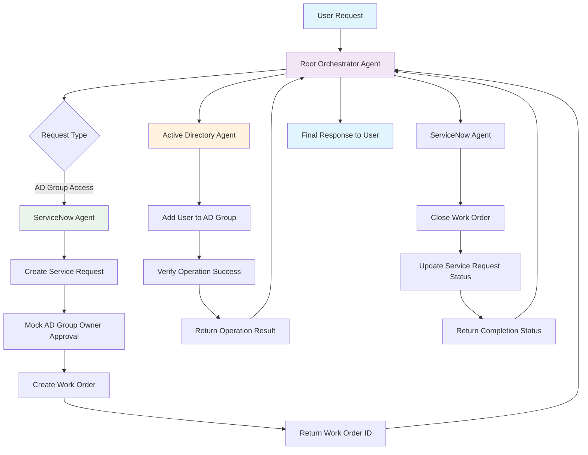
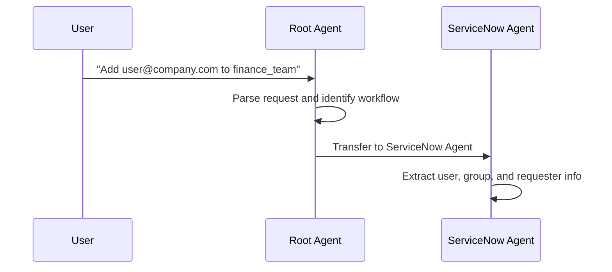
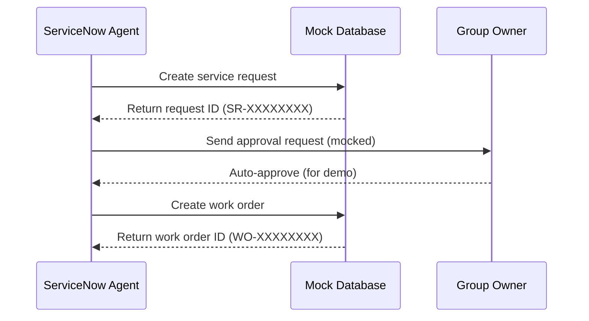
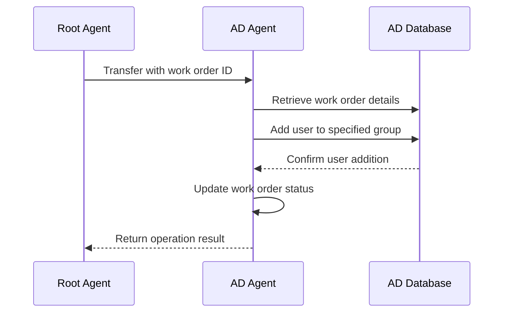
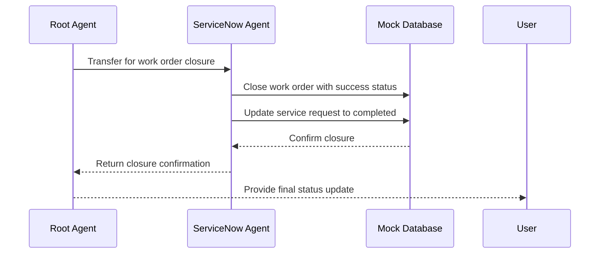

# Internal Chatbot Multi-Agent Workflow

## System Architecture Diagram



## Detailed Workflow Steps

### 1. Initial Request Processing


### 2. Service Request and Approval


### 3. Active Directory Operations


### 4. Work Order Closure


## Agent Responsibilities Matrix

| Agent | Primary Role | Key Functions | Tools Used |
|-------|-------------|---------------|------------|
| **Root Orchestrator** | Workflow coordination | - Route requests<br>- Manage agent transfers<br>- Provide status updates | None (coordination only) |
| **ServiceNow Agent** | Request management | - Create service requests<br>- Monitor approvals<br>- Manage work orders | - `create_service_request()`<br>- `get_approval_status()`<br>- `close_work_order()` |
| **Active Directory Agent** | Access management | - Add users to groups<br>- Verify memberships<br>- Ensure security | - `add_user_to_ad_group()`<br>- `verify_ad_group_membership()` |

## Data Flow

### Mock Databases

#### AD Groups Structure
```json
{
  "group_name": {
    "owner": "owner@company.com",
    "members": ["user1@company.com", "user2@company.com"],
    "description": "Group description"
  }
}
```

#### Service Requests Structure
```json
{
  "request_id": {
    "request_id": "SR-XXXXXXXX",
    "group_name": "target_group",
    "new_user_email": "user@company.com",
    "requester_email": "requester@company.com",
    "group_owner": "owner@company.com",
    "status": "pending_approval|approved|completed",
    "created_at": "2024-01-01T00:00:00",
    "work_order_id": "WO-XXXXXXXX"
  }
}
```

#### Work Orders Structure
```json
{
  "work_order_id": {
    "work_order_id": "WO-XXXXXXXX",
    "request_id": "SR-XXXXXXXX",
    "group_name": "target_group",
    "new_user_email": "user@company.com",
    "status": "ready_for_execution|ad_operation_completed|completed",
    "created_at": "2024-01-01T00:00:00",
    "completion_status": "success|failed"
  }
}
```

## Error Handling

### Common Error Scenarios

1. **Invalid AD Group**
   - Detection: Group not found in mock database
   - Response: Error message with available groups
   - Recovery: User can retry with correct group name

2. **User Already in Group**
   - Detection: User email already in group members list
   - Response: Info message about existing membership
   - Recovery: No action needed, operation considered successful

3. **Work Order Not Found**
   - Detection: Work order ID not in database
   - Response: Error message with troubleshooting steps
   - Recovery: ServiceNow agent can recreate work order

4. **Agent Transfer Failures**
   - Detection: Sub-agent cannot be reached or returns error
   - Response: Root agent provides fallback response
   - Recovery: Retry mechanism or manual intervention

## Security Considerations

### Access Control
- Group owners must approve all access requests
- Users can only be added to existing, valid groups
- All operations are logged with timestamps

### Audit Trail
- Service requests track requester and approval chain
- Work orders link to original service requests
- AD operations record success/failure status

### Data Protection
- Email addresses are validated format
- Group membership changes are atomic operations
- Mock data simulates real-world security patterns

## Scalability Features

### Extensibility Points
1. **New Agent Types**: Easy to add specialized agents for other IT operations
2. **Database Integration**: Mock databases can be replaced with real systems
3. **Approval Workflows**: Configurable approval processes
4. **Notification Systems**: Integration points for email/Slack notifications

### Performance Considerations
- Asynchronous agent operations
- Stateless agent design for horizontal scaling
- Efficient session management
- Minimal memory footprint for mock data
